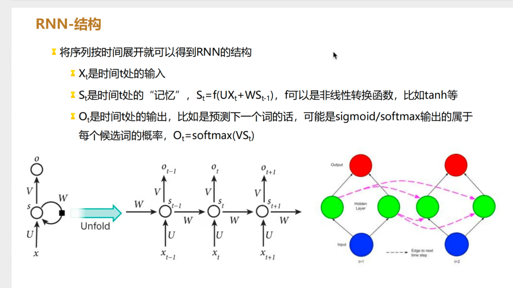

# rnn
这张图片展示了RNN（循环神经网络）的基本结构及其工作原理。以下是对图片中内容的详细解释：

## 项目图片

---

### **1. RNN结构概述**
RNN是一种可以处理序列数据的神经网络，它的核心特点是具有循环连接，可以捕捉数据的时间依赖关系。

- **时间展开（Unfolding）**：
  - 原始的RNN结构是一个循环的模块。
  - 在训练或计算过程中，RNN会将整个序列数据按照时间顺序展开，形成一个“时间步”的链条。
  - 展开后的结构展示了每个时间步的数据流动和隐藏状态的传播。

---

### **2. 关键变量和公式**
#### **输入变量：\(x_t\)**
- \(x_t\) 是第 \(t\) 时刻的输入，例如：
  - 在文本处理中，\(x_t\) 可能是当前时间步的单词。
  - 在时间序列中，\(x_t\) 可能是当前时间步的传感器数据。

#### **隐藏状态：\(s_t\)**
- \(s_t\) 是第 \(t\) 时刻的“记忆”或隐藏状态，它捕捉了当前输入和前一时刻状态的信息。
- 更新公式：
  \[
  s_t = f(Ux_t + Ws_{t-1})
  \]
  其中：
  - \(U\) 是输入到隐藏层的权重矩阵。
  - \(W\) 是隐藏层状态之间的权重矩阵。
  - \(f\) 是非线性激活函数（如tanh或ReLU）。

#### **输出变量：\(o_t\)**
- \(o_t\) 是第 \(t\) 时刻的输出。
- 在预测任务中，输出可以是：
  - 序列预测（如时间序列预测）。
  - 分类任务（如文本分类）。
- 输出计算公式：
  \[
  o_t = \text{softmax}(Vs_t)
  \]
  其中：
  - \(V\) 是隐藏层到输出层的权重矩阵。
  - softmax函数将隐藏层状态映射为概率分布。

---

### **3. 数据流动的过程**
1. **输入**：
   - 当前时间步的输入 \(x_t\) 和前一时刻的隐藏状态 \(s_{t-1}\) 一起输入到当前隐藏层。
2. **隐藏层更新**：
   - 隐藏层计算新的状态 \(s_t\)，结合了当前输入和之前的状态。
3. **输出层**：
   - 隐藏状态 \(s_t\) 通过权重矩阵 \(V\) 映射到输出层，计算输出 \(o_t\)。

---

### **4. 图中的符号解释**
- **左侧结构（单步RNN模块）**：
  - 一个典型的RNN单元，展示了输入 \(x\)、隐藏状态 \(s\)、输出 \(o\) 之间的关系。
  - 矩阵 \(U\)、\(W\)、\(V\) 分别连接输入、隐藏层、输出层。

- **中间结构（时间展开的RNN）**：
  - RNN在时间上的展开，将每个时间步的输入、隐藏状态和输出都显示出来。
  - 时间步 \(t-1, t, t+1\) 之间隐藏状态 \(s_t\) 的传播（通过权重矩阵 \(W\)）展示了时间依赖性。

- **右侧图（更直观的时间展开示意图）**：
  - 展示了序列数据在时间上的流动。
  - 输入（蓝色）通过隐藏层（绿色）传递到输出（红色）。
  - 每个时间步的隐藏状态 \(s_t\) 连接在一起，捕捉时间序列的依赖关系。

---

### **5. 应用场景**
RNN适用于以下类型的任务：
1. **自然语言处理（NLP）**：
   - 机器翻译（输入一个句子，输出翻译后的句子）。
   - 文本生成（如自动写作、对话系统）。
   - 情感分析（从文本中判断情感是正面还是负面）。
2. **时间序列分析**：
   - 股票价格预测。
   - 传感器数据分析。
3. **语音处理**：
   - 语音识别。
   - 音乐生成。

---

### **6. RNN的局限性**
1. **梯度消失和梯度爆炸**：
   - 随着时间步加长，梯度会迅速减小或增大，导致模型难以捕捉长时间依赖。
2. **效率较低**：
   - RNN是顺序模型，无法并行处理，计算效率较低。
3. **改进模型**：
   - 为了克服这些问题，提出了改进的RNN模型：
     - **LSTM（长短期记忆网络）**：通过门控机制保存长期记忆。
     - **GRU（门控循环单元）**：更轻量化的LSTM变种。
     - **Transformer**：通过注意力机制完全替代了RNN。

---

### **总结**
这张图清晰地展示了RNN的基本结构和数据流动过程。RNN通过时间步间的隐藏状态传播捕捉序列数据的依赖关系，适合处理动态序列问题。然而，由于其局限性，在长序列问题上通常采用改进模型（如LSTM或Transformer）来替代。
